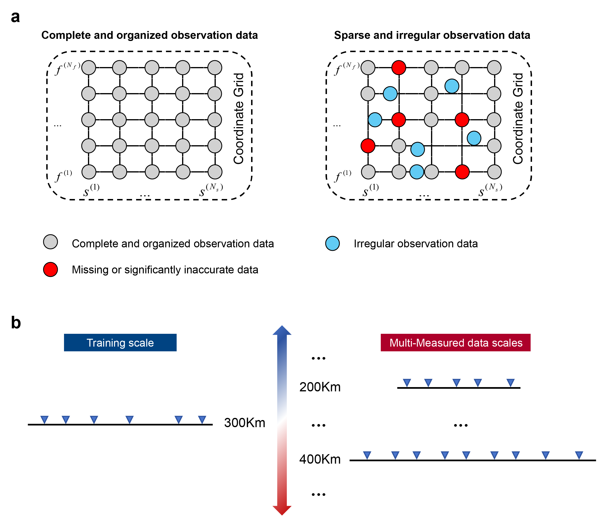

# A Reversible Deep Operator Network for Grid-Independent, Multi-Scale Magnetotelluric Inversion and Uncertainty Quantification

## Key Points
- We propose Reversible Deep Operator Network to solve magnetotelluric inversion from arbitrarily sparse observational data.
- RDON trained on a single spatial scale can zero-shot generalize to unseen scales with transfer learning correcting scale-induced biases.
- A Bootstrap Resampling scheme  based on RDON enables efficient uncertainty quantification of solutions.

## Abstract
Magnetotellurics (MT) is a powerful geophysical tool that probes subsurface electrical structures by utilizing natural electromagnetic signals, yet traditional inversion methods often face challenges related to high computational costs, non-uniqueness, and a strong sensitivity to initial model assumptions. Recently, deep neural networks have shown great promise in MT inversion. However, current deep learning methods struggle with sparse and irregularly gridded data, requiring retraining for each new observation setup, thus limiting their applicability to real-world sparse and multi-scale data. To address this limitation, we proposes a novel deep learning framework, Reversible Deep Operator Network (RDON) for efficient inversion of arbitrarily sparse MT data. RDON leverages a RealNVP-based invertible neural network integrated into DeepONet architecture to establish a bijective mapping between subsurface resistivity and MT data, enabling grid-independent forward and inverse modeling within a single network. This architecture demonstrates the capability to flexibly handle arbitrarily sparse MT data without retraining, and exhibits robust generalization across unseen variations in station layout and frequency configurations. As to scaling generalization, we establish the Scaling Invariance Theorem for MT, which provides both theoretical grounding and rigorous quantification of cross-scale generalization errors. This enables the trained network to perform zero-shot generalization across survey scales and further reduces scaling-related errors through transfer learning with fine-tuning. Additionally, RDON incorporates a Bootstrap Resampling-based approach for uncertainty quantification, offering significant computational efficiency improvements over conventional methods. Applied to real-world data from the West Junggar region, RDON validates its reliability and practicality under complex geological conditions. This work presents a transformative approach for MT inversion, addressing long-standing challenges of observation sparsity, computational inefficiency, and uncertainty quantification.

<div align="center">

</div>

## Key Features
- 🧠 **Bijective Operator Learning**: Reversible architecture enables dual-directional modeling
- 🌐 **Grid-Independent inversion**: Handles arbitrary station/frequency configurations
- 📐 **Scale-Invariant Predictions**: Theoretical guarantees for cross-scale generalization
- 📊 **Efficient Uncertainty Quantification**: Bootstrap resampling for solution confidence
- ⚡ **Real data test**: Real-time inversion capabilities


## Framework


## Dependencies
```
environment.yml
```


## Dataset Generation
The forward modeling module in this repository is adapted from [EFNO](https://github.com/zhongpenggeo/EFNO). We leverage its capabilities to perform efficient electromagnetic simulations, which serve as the foundation for our inversion framework.


## Getting Started

### 1. Data Preparation
The training and testing datasets, along with the pre-trained model parameters used in our paper, are publicly available on Zenodo. You can download them from the following link:

> **[Download Data & Models (Zenodo)](https://zenodo.org/records/17073125)**

Please unzip the downloaded files into the `./data` and `./model` directory (or specify your path).

### 2. Model Training
We provide the training script and configuration file to reproduce our results or train on new data:

* **Configuration (`train_32_32.yml`)**: This file contains all the hyperparameters (e.g., learning rate, batch size, epochs) and file paths. You can modify this file to customize the training setup.
* **Training Script (`train.ipynb`)**: Open and run this Jupyter Notebook. It loads the configuration from the YAML file and executes the training pipeline.


## Acknowledgements

The development of **RDON** was significantly facilitated by the following open-source projects:

* **Forward Modeling:** We utilized the [EFNO](https://github.com/zhongpenggeo/EFNO) framework for efficient electromagnetic simulations.
* **Invertible Network:** We acknowledge the [realnvp-pytorch](https://github.com/henrhoi/realnvp-pytorch) repository, which greatly facilitated the implementation of the invertible components within our **RDON** method.

We thank the authors of these repositories for their valuable contributions to the community.